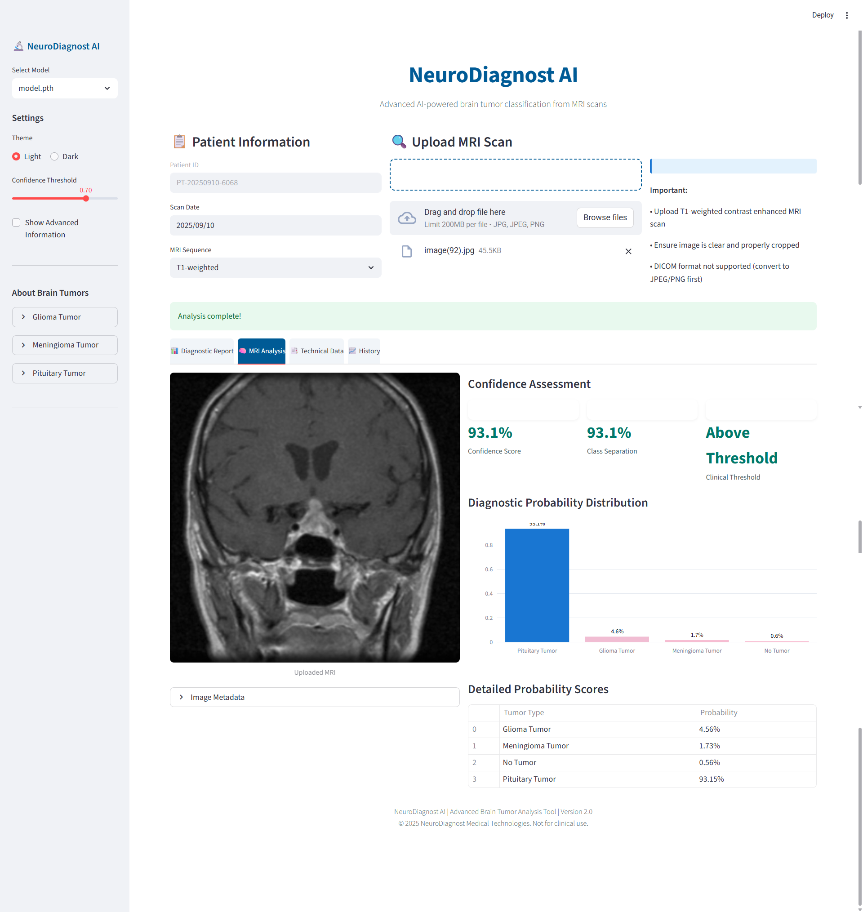

# 🧠 NeuroDiagnost AI: Brain Tumor Classification


A production-ready deep learning system for brain tumor classification from MRI images, built with a complete MLOps pipeline including model training, evaluation, experiment tracking, and deployment.


## Interface Previews



## 🧪 Dataset

The model is trained on the Brain Tumor MRI Dataset, which contains T1-weighted contrast-enhanced images. The dataset structure:

```
data/
  ├── Training/
  │   ├── glioma_tumor/
  │   ├── meningioma_tumor/
  │   ├── no_tumor/
  │   └── pituitary_tumor/
  └── Testing/
      ├── glioma_tumor/
      ├── meningioma_tumor/
      ├── no_tumor/
      └── pituitary_tumor/
```

## 🚀 Getting Started

### Prerequisites

- Python 3.12+
- CUDA-compatible GPU (recommended for training)
- Docker (optional, for containerized deployment)
- AWS CLI (optional, for AWS deployment)

### Local Setup

1. Clone the repository:
   ```bash
   git clone https://github.com/hafizshakeel/ai-brain-tumor-classification-system.git
   cd ai-brain-tumor-classification-system
   ```

2. Create a virtual environment and install dependencies:
   ```bash
   python -m venv venv
   source venv/bin/activate  # On Windows: venv\Scripts\activate
   pip install -r requirements.txt
   ```

3. Run the complete ML pipeline with DVC:
   ```bash
   dvc repro
   ```

4. Launch the Streamlit web application:
   ```bash
   streamlit run app.py
   ```

### Docker Setup

1. Build the Docker image:
   ```bash
   docker build -t brain-tumor-classifier .
   ```

2. Run the container:
   ```bash
   docker run -p 8501:8501 brain-tumor-classifier
   ```

3. Access the application at http://localhost:8501

## 🔄 DVC Pipeline

This project uses DVC (Data Version Control) to orchestrate the ML pipeline. The pipeline consists of these stages:

1. **Data Ingestion** - Download and prepare the dataset
2. **Base Model Preparation** - Set up the pre-trained Swin Transformer
3. **Model Training** - Fine-tune the model on brain tumor data
4. **Model Evaluation** - Generate performance metrics and evaluation reports

To run the full pipeline:
```bash
dvc repro
```

To run a specific stage:
```bash
dvc repro -s stage_name
```

To visualize the pipeline:
```bash
dvc dag
```

## 📊 MLflow Tracking

This project uses MLflow to track experiments, including:

- Model parameters
- Training and validation metrics
- Model artifacts
- Performance visualizations

To view the MLflow dashboard:
```bash
mlflow ui
```

Remote tracking is configured with DagsHub. Set your tracking URI:
```bash
export MLFLOW_TRACKING_URI=https://dagshub.com/hafizshakeel/brain_tumor_classification.mlflow
```

## 🧠 Model Architecture

The system uses a Swin Transformer (`swin_tiny_patch4_window7_224`) as the base model, which is fine-tuned on the brain tumor dataset.

Key model features:
- **Architecture**: Hierarchical vision transformer with shifted windows
- **Pre-training**: ImageNet weights
- **Input Size**: 224x224 pixels
- **Fine-tuning**: Last layers trained for the 4-class tumor classification

Model hyperparameters are configured in `params.yaml` and can be modified without changing code.

## 📦 Project Structure

```
brain_tumor_classification/
├── app.py                     # Streamlit web application
├── predict.py                 # Prediction module for inference
├── main.py                    # Main pipeline orchestrator
├── dvc.yaml                   # DVC pipeline definition
├── params.yaml                # Model hyperparameters
├── Dockerfile                 # Docker configuration
├── .github/workflows/         # GitHub Actions CI/CD
├── config/                    # Configuration files
│   └── config.yaml            # Project configuration
├── src/
│   └── brain_tumor_classification/
│       ├── components/        # Core ML components
│       │   ├── data_ingestion.py
│       │   ├── prep_base_model.py
│       │   ├── model_trainer.py
│       │   └── model_eval.py
│       ├── pipeline/          # Pipeline orchestration
│       ├── config/            # Configuration utilities
│       ├── entity/            # Data entities
│       └── utils/             # Utility functions
├── artifacts/                 # Generated artifacts (DVC-tracked)
├── logs/                      # Application logs
└── notebook/                  # Jupyter notebooks for experimentation
```

## 🌩️ AWS Deployment

This project includes CI/CD for deployment to AWS using GitHub Actions.

### Prerequisites

1. AWS Account with permissions for:
   - ECR (Elastic Container Registry)
   - EC2 (Elastic Compute Cloud)
   - IAM (Identity and Access Management)

2. Set up the following GitHub repository secrets:
   - `AWS_ACCESS_KEY_ID`
   - `AWS_SECRET_ACCESS_KEY`
   - `AWS_REGION` (e.g., us-east-1)
   - `AWS_ECR_LOGIN_URI` (your-account-id.dkr.ecr.region.amazonaws.com)
   - `ECR_REPOSITORY_NAME` (e.g., brain_tumor_classification)

### Deployment Steps

1. Create an ECR repository:
   ```bash
   aws ecr create-repository --repository-name brain_tumor_classification --region us-east-1
   ```

2. Get the repository URI:
   ```bash
   aws ecr describe-repositories --repository-names brain_tumor_classification --query 'repositories[0].repositoryUri'
   ```

3. Set up a self-hosted GitHub Actions runner on your EC2 instance for deployment.

4. Push to the main branch to trigger the CI/CD pipeline.


## 🤝 Contributing

Contributions are welcome! Please feel free to submit a Pull Request.

## 📝 License

This project is licensed under the MIT License - see the LICENSE file for details.

## 📧 Contact

📩 **Need professional support?** [Contact me](mailto:hafizshakeel1997@gmail.com) for assistance.  


